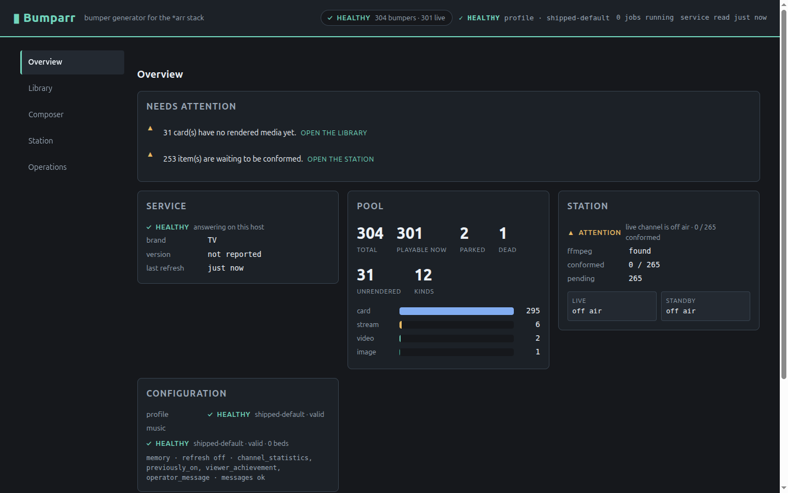
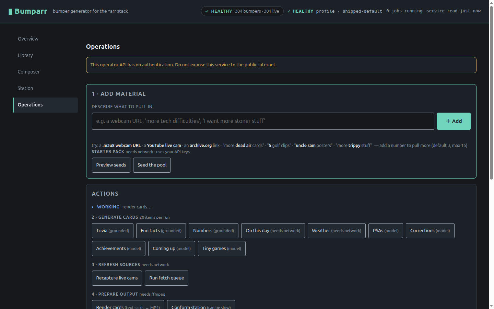

# Historical frontend browser captures

These captures were produced during the 2026-09-05 frontend-plan work, before
the Generation view was integrated into the operator console. They preserve
the teammate's original evidence; they are not screenshots of the final
combined branch or proof of paid-provider acceptance.

- `1440x900-*`: desktop layouts, inspector/confirmation, playback, empty and
  offline states, long listings, and reduced motion.
- `1024x768-*`, `390x844-*`, `320*`: responsive layout checks.
- `720x450-*`, `200pct-*`, `zoom200-*`: compact/zoom captures. A filename alone
  is not independent proof of browser zoom configuration.
- `emptydb-*`: empty-pool views.

The full matrix and its Firefox limitation are recorded in
[the frontend plan](../../FRONTEND_PLAN.md). See
[the PR summary](../../PR_SUMMARY.md) for combined-branch verification.

Representative historical views:

